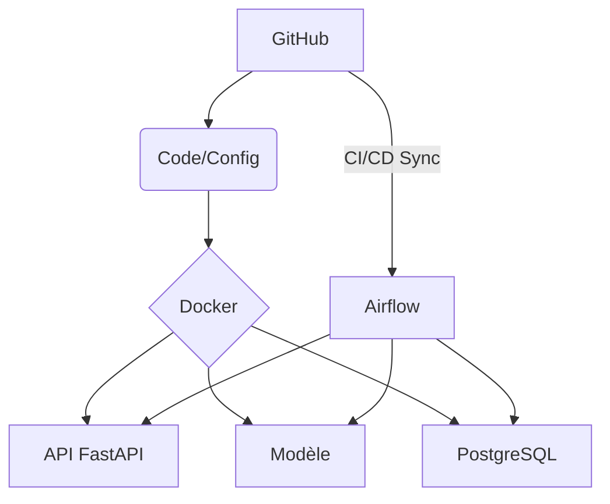

# METHODOLOGIE

## Principes généraux

Dès le lancement du projet, je pose comme objectif central de créer une application web de recommandation de films qui respecte les principes du MLOps. Pourquoi ? Parce que le MLOps permet de dépasser le simple prototype pour garantir une mise en production fiable, évolutive et maintenable des modèles de machine learning. Il s’agit d’automatiser, versionner, surveiller et collaborer tout au long du cycle de vie du projet, pour éviter que les efforts de data science ne restent bloqués au stade expérimental.

Concrètement, cela signifie que je vais :

- Versionner systématiquement le code, les données et les modèles avec **GitHub**. Cela assure la traçabilité, la reproductibilité et facilite le travail en équipe.
- Isoler chaque composant dans des conteneurs **Docker** pour garantir que tout fonctionne de la même façon en développement, test et production, sans conflit de dépendances.
- Orchestrer les différentes étapes du pipeline (ingestion, entraînement, déploiement) avec **Apache Airflow**, afin d’automatiser les tâches répétitives et de pouvoir relancer facilement les étapes en cas d’erreur.
- Suivre les expérimentations et versionner les modèles grâce à **MLflow**, ce qui permet de comparer objectivement les performances et de revenir à une version antérieure si besoin.

L’ordre de mise en place est progressif :
1. **GitHub** et la structuration du code pour poser les bases du versionnement.
2. **Docker** pour garantir l’isolation et la portabilité dès les premiers tests.
3. **MLflow** pour tracer les expérimentations dès le début de l’entraînement des modèles.
4. **Airflow** pour automatiser et orchestrer le pipeline une fois les premières briques fonctionnelles.

Cette méthodologie est pensée pour évoluer : elle pose un cadre robuste mais reste suffisamment souple pour s’adapter aux découvertes et besoins du projet au fil du temps. L’objectif est clair : industrialiser rapidement une première version (MVP), tout en préparant le terrain pour l’amélioration continue et la montée en charge.

## Première étape

Nous avons comme but de respecter un schéma d'évolution simple:

MVP ➡ Industrialisation ➡ Mise en production

On va donc débuter par la mise en place de notre dépôt github et construire nos premiers conteneurs (Airflow, MlFlow, Postgres, FastApi, Streamlit)

Voici un premier diagramme de notre projet:

